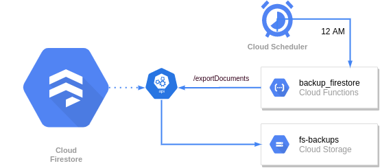

## Firestore DB backup

Managed firestore backups are unfortunately one of the missing features of the 
Firebase/GCP platform. Thankfully firestore provides API calls for importing
and exporting the firestore data. With these calls we are able to construct
simple periodic backup pipeline as well as repair the data in case of botched
migration or other data-damaging event.

*So how does it work?* 

Well, here is a small diagram that describes the process.



We can see that is contains 4 GCP services:

 * **Cloud Firestore** (duh!)
 * **Cloud Scheduler** - service capable of sending HTTP requests and Pub/Sub events based on real time
 * **Cloud Function** - contains backup logic
 * **Cloud Storage** - holds backed up data
 
The [terrafom](https://github.com/LukasSlouka/demos/tree/master/firestore-backup/terraform) folder contains
the entire infrastructure configuration. See README in there for further instructions on how to apply it
to your existing or new project. If you have any troubles then I am sure you can handle it, you are probably
an engineer anyway... 

Entire business logic is contained within the [main.py](https://github.com/LukasSlouka/demos/tree/master/firestore-backup/main.py)
file. Function performs authorized call to [Firestore API](https://firebase.google.com/docs/firestore/reference/rest/v1beta1/projects.databases)
which should result in creation of new backup file in the specified bucket. You can do all sort of funky
stuff in there. I included sending confirmation slack message to the preconfigured slack channel to notify
project team of (un)successful backups.

**How can I restore the data?**

Google wisely included import (and export) functionality in their CLI. Simply run

```bash
gcloud firestore import gs://<BUCKET_NAME>/<BACKUP_NAME>
```

This operation will kick-off firestore operation and log out something like:

```
Waiting for [projects/<PROJECT>/databases/(default)/operations/<OPERATION_ID>] to finish.
```

Take note of the `OPERATION_ID` value. You can monitor the status of the operation with 
`gcloud firestore operations describe <OPERATION_ID>` and even cancel it with
`gcloud firestore operations cancel <OPERATION_ID>`. To list all operations run
`gcloud firestore operations list`.

*Few notes about GCS data*

* Surely you noticed that data generated by export are not readable directly, so you have to use `import`
to use them.
* You do not have to import the entire backup. You can also import only selected collections.
* Import can not delete data from collection, only update and recreate.
* I've prepared [2 scripts](https://github.com/LukasSlouka/demos/tree/master/firestore-backup/scripts) to help you
test it out. Just make sure you have `GOOGLE_APPLICATION_CREDENTIALS` in order to use them.

**What about pricing?**

Is money all you care about? ... do not worry, me too, that's why I've included this section. As we all
know (winky face), Firestore charges per each read, write and delete. Although the charges are very small
(few cents per 100k operations), they can ramp up pretty quickly if you access a lot of data and backups
obviously do. *Or do they?* Export allows you to back up only subset of collections which means you can
omit large collections that do not hold crucial data (such as comments). By this you can reduce the number
of reads that are performed by backups significantly reaching a point when the charge caused by this operation
is insignificant.

*Few notes about billing at the end*

* Export operations will be charged after the export is complete (API will not shut down exports
mid way through because of exceeded quotas)
* You'll do the best if you monitor firestore read quota (you can find it under App Engine quotas) and 
compare it with expected values.
* Always set up billing alerts in Cloud Billing section

### References

 - [Firestore export and import REST API](https://firebase.google.com/docs/firestore/reference/rest/v1beta1/projects.databases)
 - [Firestore export and import CLI](https://firebase.google.com/docs/firestore/manage-data/export-import)
 - [Firestore pricing](https://firebase.google.com/docs/firestore/pricing) - video here is especially helpful
