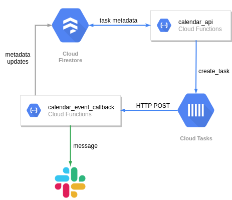

## Serverless calendar

Imagine the following use case:

> For every new user on the platform we want to send them reminder after 2 weeks to finish their
> account setup. In case they still do not do so then remind them again after 1 additional week.

The first thing that comes to mind is to set up a calendar service that maintains an ordered queue 
of events with timestamps and triggers necessary actions. Naturally, this service would need to be 
running at all times, and its scalability is also quite questionable. Needless to say, it does not 
look like an easy-to-implement or a cost-efficient solution

This is where *GCP Cloud Tasks* service comes in handy. This demo builds a simple serverless
infrastructure that hosts miniature API, through which you can create timed slack notifications.



Infrastructure parts:

 * **Cloud Firestore** - used to store event metadata, in this case the entire task
 * **Cloud Tasks** - GCP service used for timed asynchronous execution
 * **Cloud Function** - 1 function for the API and 1 function for cloud task handling

**Code organization and logic description**

 * [terrafom](https://github.com/LukasSlouka/demos/tree/master/serverless-calendar/terraform) folder contains the
 entire infrastructure configuration. See README in there for further instructions on how to apply it to your existing
 or new project.
 * [api](https://github.com/LukasSlouka/demos/tree/master/serverless-calendar/terraform) folder contains implementation
 of the API cloud function. Function provides 2 routes: `/ GET` and `/ POST`. GET returns all existing (both future
 and past) events from firestore without pagination or any other capabilities. POST creates new event and accepts
 following JSON request format shown below. `timestamp` value schedules task execution and defaults to now. `timedelta`
 defines the number of seconds before the task is executed after the `timestamp` value. `repeat` defines how many times
 the task should be executed, with `timedelta` being the time difference between each execution. `message` defines
 the slack message that will be sent to the selected slack channel. This cloud function is publicly accessible when
 deployed.
 
```json
{
  "timestamp": "2020-10-10T01:00:00",
  "timedelta": 10,
  "repeat": 3,
  "message": "Test message"
}
```

 * [event](https://github.com/LukasSlouka/demos/tree/master/serverless-calendar/terraform) folder contains
 implementation of cloud task handler. This function does not allow unauthenticated access, therefore the
 service account that is used in cloud task definition must have `cloudfunctions.invoker` rights. In addition
 to that, the function may create new task if the `repeat` value is a positive integer. In that case the function
 recreates the same task with decremented `repeat` value. If the slack related environment variables are
 correctly set, the function will post a message to the selected channel.

**More about cloud tasks**
 
 - You can write cloud task handlers into your microservices which is great for service decoupling.
 - Cloud tasks provide quite generous free tier of 1 million monthly operations ($0.40 for each additional million) 
 - Maximum schedule time for a task is 30 days from current date and time
 - Task can be deleted from the queue before it is executed, you just need to know its name

### References
 - [Cloud Tasks quotas and pricing](https://cloud.google.com/tasks/docs/resources-index)
 - [Cloud Tasks concepts](https://cloud.google.com/tasks/docs/concepts-index)
 